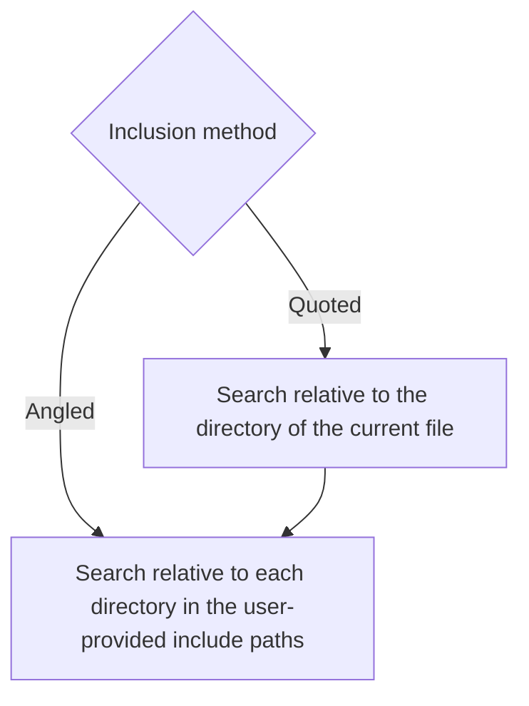
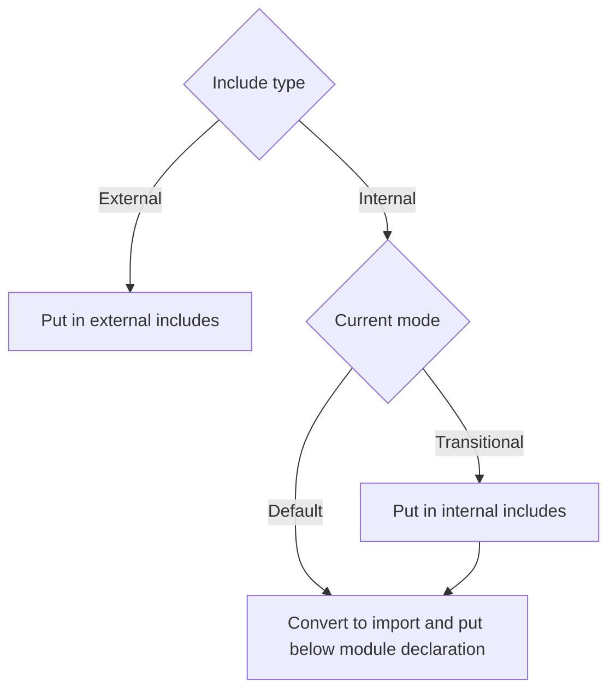

# Background
I want more people to use modules because they were brought in to address problems that comes with the `#include` directive (that I hate):
- **Slow Compilation:** Each `#include` recursively expands into many lines of code. For instance, `<iostream>` may add over 30,000 lines, and if used in multiple files, it’s processed repeatedly. Modules are compiled once and then reused.
- **Poor Encapsulation:** `#include` simply copies file content, exposing everything inside. Modules allow you to explicitly export only the necessary parts, keeping private details hidden.
- **Messy Syntax:** Modules eliminate the need for include guards or `#pragma once` because they are imported only once.

For a more detailed introduction to C++ modules, check out [this article](https://vector-of-bool.github.io/2019/03/10/modules-1.html).

# Concepts and Terminology

## Header vs. Source
- You know what these are.
- Importizer determine header and source based solely on the file extension that users can customize.

### Paired Files
- A paired file consists of a header (e.g., `file.hpp`) and a corresponding source file (e.g., `file.cpp`). Usually, paired headers contains declarations, and paired source contains implementations.
- Importizer determine if the current file is paired by changing the extension from source to header or vice versa and checking if the new file exists. 

### Source With `main()`
- An **unpaired** source file with a main function. A source with a the main function should not be paired.
- Importizer determine this by scanning for a main function.

## Conversion Rules

## Module Interface Unit
- A module unit similar to a header: it declares entities, but it only expose those entities for consumer if you choose to export.
- **Conversion:**
  - All headers (paired or not) become interface units because of their similar purpose.
  - Unpaired sources without `main()` are also converted to interface units because there is no other good convertion.

### Module Implementation Unit
- A module unit that implements the entities declared in a module interface unit.
- **Conversion:**
  - Paired source files are converted to implementation units.

### Module Consumer
- A file that uses modules instead of providing module content.
- **Conversion:**
  - Sources with `main()` because they run code without providing any functions to other files, and also because the `main` function cannot belong to any modules.

# General

## Generating the Module Declaration
To generate the module declaration, each module is assigned a name based on its relative location to the input directory. For example, if a file's path is `glaze/util/atoi.hpp` and the input directory is `glaze`, the module name is `util.atoi`. This naming convention ensures consistent resolution of module names across different files. For interface units, the declaration is `export module moduleName`. For implementation units, it's just `module moduleName;` with the same name as one in an interface unit for the compiler to figure out that they are pairs.

## Handling Includes
Module units should not contain #include directives outside the global module fragment (GMF), as this would bind the module to the included file's content. To manage includes, we categorize them as internal (within the input directory) and external (outside the input directory). The classification process is inspired by the `-I` flag used by compilers:

Then, we process them according to below:

Regarding includes that depend on preprocessor definitions (e.g., `windows.h` relying on the `UNICODE` macro), we replicate the exact macro hierarchy of the file. For instance, if the original code is:
```cpp
#ifdef WIN32
#define UNICODE
#include <windows.h>
#endif
```
After modularization, the GMF will contain:
```cpp
module;
#ifdef WIN32
#define UNICODE
#include <windows.h>
#endif
// Rest of file
```
This method preserves the preprocessor conditions affecting external includes. Note that importizer does not know if a file actually need such definition, so it always replicate.

# Default Mode

## The Default Preamble
```cpp
module; // Starts the GMF
// External includes...
export module moduleName; // Module declaration, ends the GMF
// Imports...
```

## Handling Include Guards
In default mode, they are removed, because modules doesn't need them.

# Transitional Mode
Transitional mode is all about maintaining backward compatibility.

## Handling Include Guards
In transitional mode, a `#pragma once` or `#ifndef` and `#define` is moved up to the top of the preamble. The `#endif` will stay still.

## The Transitional Preamble
```cpp
// Include guards
#ifdef [value of mi_control]
module; // Starts the GMF
#endif
#include "[location of Export.hpp]"
// External includes...
#ifdef [value of mi_control]
export module moduleName; // Module declaration, ends the GMF
// Imports...
#else
// Internal includes...
#endif
```
I created this hybrid structure to support both header and modules. If `[value of mi_control]` isn't defined, the preamble fallbacks to being a regular header, else, it will be a module. With this, you can simply add a `-D[value of mi_control]` when compiling the file to switch to module mode. This is especially useful for API that doesn't want to break backward compatibility while writing less code.

## Export.hpp
What is `Export.hpp` you might ask, it's a file that looks like this to allow optional export in transitional mode:
```cpp
#ifdef [value of mi_control]
#define [value of mi_exportKeyword] export
#define [value of mi_exportBlockBegin] export {
#define [value of mi_exportBlockEnd] }
#else
#define [value of mi_exportKeyword]
#define [value of mi_exportBlockBegin]
#define [value of mi_exportBlockEnd]
#endif
```
This file allows you to just place the appropriate macro identifier around exported entities, and just toggle with exporting code with `-D[value of mi_control]`.

## Backward compatibility

# Detailed methodology
Importizer is split into different "modules", the purpose of each is as follow:
1. **Directive:**
    - Classify and extract extra information from preprocessor directives.
    - Resolve includes
    - Determine if an include is standard.
2. **Driver:**
    - Call functions from other modules to drive the program.
    - Generate `Export.hpp` in transitional mode.
    - Determine if a file will have to be chosen what to export
    - Generate backward compatibility headers
3. **FileOp:**
    - Provide file reading and writing facilities
    - Get headers and sources to process and classify file type.
4. **Minimizer:**
    - Reduce the size of the condition hierarchy.
5. **OptProcessor:**
    - Process options passed in by the user from the CLI or the TOML file.
6. **Preamble:**
    - Generate and add the preamble.
7. **Preprocessor:**
    - Handle preprocessor directive depending on the type.
    - Determine if a source has a main function.
    - Determine the position of the preamble.
8. **Regex:**
    - A RAII wrapper for the PCRE2 library, used in matching include guards.
9. **Util:**
    - Provide printing, error handling and program control-flow facilities.

Further documentation are commented in the code from those file.