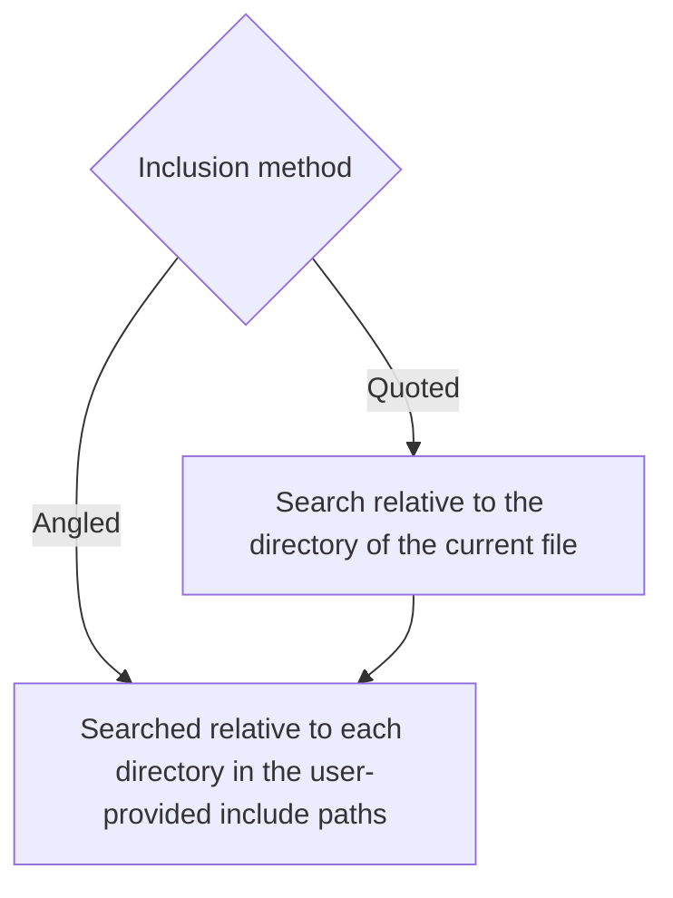
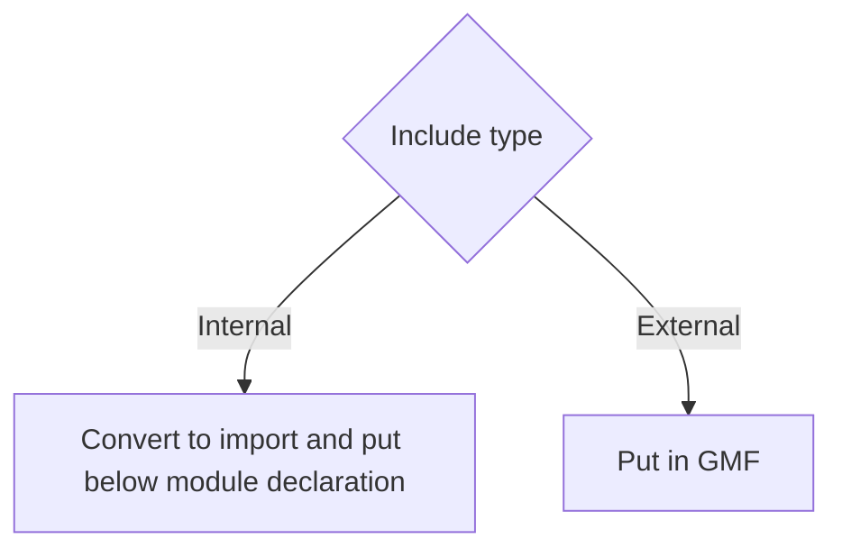

# Background
I want more people to use modules because they were brought in to address problems that comes with the `#include` directive (that I hate):
- **Compilation time:** `#include`s will be expanded recursively, meaning `#include`s inside `#include` will also be expanded, and so on. With just `#include <iostream>`, GCC 14.2 will produce a file with 30914 lines of code. If you use include `iostream` in many files, the compiler will process that exact same 30914 lines that many times. In contrast, modules don't need to be recompiled every time it is imported, it is compiled exactly once and reused, avoiding redudant processing.
- **Encapsulation:** Since `#include`s are just copying and pasting, it will expose everything inside the included files, whether you want it or not. In contrast, modules allow you to choose what is exposed to users (exported). Macros, `#include`s, entities from other imported modules and non-exported entities from a module will strictly stay in that module.
- **Cleaner syntax:** No need for include guards or pragma once because they are only imported once

# Overview
An excellent introduction to C++ modules is available [here](https://vector-of-bool.github.io/2019/03/10/modules-1.html).

## Concepts and terminology

### Header And Source
Importizer determine header and source from the file extension that the user provide.

### Paired Files
A usual file structure in C++ is that we have a header to declare entities like classes or functions, and an equivalent source file with the same base name (eg. `input/directory/file.hpp` and `input/directory/file.cpp`) to implement those entities. I call these files "paired" and I refer to one of them as "paired header" or "paired source".

### Source With `main()`
An **unpaired** source file with a `main` function. A paired source with a `main()` is undefined behavior, because these should never exist.

## Conversion Rules
| File type | Paired file?       | Contains `main()`? | Conversion type            | Exporting required |
|-----------|--------------------|--------------------|----------------------------|--------------------|
| Header    |                    | N/A                | Module interface unit      | :heavy_check_mark: |
| Header    | :heavy_check_mark: | N/A                | Module interface unit      | :heavy_check_mark: |
| Source    |                    |                    | Module interface unit      | :heavy_check_mark: |
| Source    | :heavy_check_mark: |                    | Module implementation unit |                    |
| Source    |                    | :heavy_check_mark: | Module consumer            |                    |

### To Module Interface Unit
Modules brought us the perfect equivalent of a header: a module interface unit. These are module units with `export` before the module declaration, as in `export module [name];`. Like headers, its purpose is to provide entities for other modules, though it doesn't force you to expose everything. You will have to explicitly export any entities for use in other modules. Due to their similar functionalities, we will convert all headers, paired or not, to interface units. There is a special case: An unpaired source without a `main()` will also be converted to an interface unit, simply because there is no other suitable conversion.

### To Module Implementation Unit
These are module units without `export` before the module declaration, as in `module [name];`. The `[name]` will be the same as one in an interface unit for the compiler to figure out that they are pairs. These are used to implement a module interface unit, and obviously doesn't allow any `export`. We will convert paired source to an implementation unit.

### To Module Consumer
As the name suggest, we will not make these files any kind of module units, only convert `#include`s to `import`s. This is done for sources with `main()` because they run code without providing any functions to other files, and also because the `main` function cannot belong to any modules.

## General Conversion Method
With those rules and concept in mind, we can dive into modifying the file content. 

### `#Include`
Module units can't have any `#include` outside the global module fragment (GMF) because it will make the content of the included file attached to that module. There are two types of includes we internal (including file inside the input directory) and external (including file outside the input directory). We classify them according to below (inspired by the `-I` flag of compilers):

Then, we process them according to below:

You might ask, "What if an include rely on preprocessor definitions, such as `windows.h` depend on the `UNICODE` macro to alter its behavior?" Well, we will recreate the exact macro hierarchy that before that include. What I meant is, originally, say we have this:
```cpp
#ifdef WIN32
#define UNICODE
#include <windows.h>
#endif
```
After modularizing, an exact copy will appear in the GMF:
```cpp
module;
#ifdef WIN32
#define UNICODE
#include <windows.h>
#endif
// Rest of file
```
This approach ensures any condition that might affect the external include in any way will not be changed.