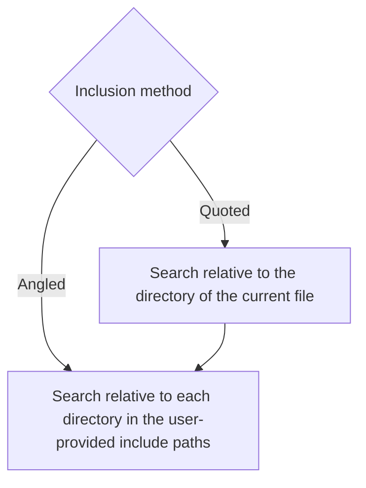
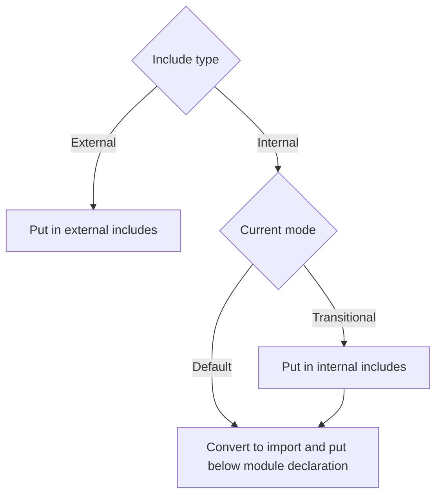

This document provides a technical overview of the design and mechanism of importizer.
# Table of Contents
- [Prerequisite](#prerequisite)
- [Background](#background)
- [Concepts and Terminology](#concepts-and-terminology)
   * [The Preamble](#the-preamble)
   * [Header vs. Source](#header-vs-source)
   * [Paired Files](#paired-files)
   * [Source With `main()`](#source-with-main)
- [General Method](#general-method)
   * [Conversion Rules](#conversion-rules)
     + [Module Interface Unit](#module-interface-unit)
     + [Module Implementation Unit](#module-implementation-unit)
     + [Module Consumer](#module-consumer)
   * [Generating the Module Declaration](#generating-the-module-declaration)
   * [Handling Includes](#handling-includes)
- [Default Mode](#default-mode)
   * [The Default Preamble](#the-default-preamble)
   * [Handling Include Guards](#handling-include-guards)
- [Transitional Mode](#transitional-mode)
   * [Handling Include Guards](#handling-include-guards-1)
   * [The Transitional Preamble](#the-transitional-preamble)
   * [Export.hpp](#exporthpp)
   * [A Small Compromise](#a-small-compromise)
- [Code Design](#code-design)

# Prerequisite
- This document contains [mermaid](https://mermaid.js.org) diagrams that requires a supported renderer such as Github Markdown.
- This document assumes:
  - You are comfortable with C++, C++ modules (check out [this excellent article](https://vector-of-bool.github.io/2019/03/10/modules-1.html) for a detailed introduction).
  -  Read through the [README.md](README.md), especially the option section.
- Throughout the document you will see `[]` with an option name inside, it means replace it with the value of the option. For example, `[hdrExt]`, with default option will be replaced by `.hpp`.

# Background
I am a module advocate because they were brought in to address problems that comes with `#include`:
- **Slow Compilation:** Each `#include` recursively expands into many lines of code. For instance, `<iostream>` may add over 30,000 lines, and if used in multiple files, it’s processed repeatedly. Modules are compiled once and then reused.
- **Poor Encapsulation:** `#include` simply copies file content, exposing everything inside. Modules allow you to explicitly export only the necessary parts, keeping private details hidden.
- **Messy Syntax:** Modules eliminate the need for include guards or `#pragma once` because they are imported only once.

Because of that, I want to make modularization as easy as possible to encourage people to modularize their projects.

# Concepts and Terminology

## The Preamble
For every file, importizer generate what I call the "preamble" that declares the dependencies of a file. It is placed at either the very start of the file, or after a SOF comment. The structure of this preamble depend on the modularization mode.

## Header vs. Source
- Of course you know what these are.
- Importizer determine header and source based solely on the file extension.

## Paired Files
- A paired file consists of a header (e.g., `file.hpp`) and a corresponding source file (e.g., `file.cpp`). Usually, paired headers contains declarations, and paired source contains implementations.
- Importizer determine if the current file is paired by changing the extension from source to header or vice versa and checking if the new file exists. 

## Source With `main()`
- An **unpaired** source file with a main function. A source with a the main function should not be paired.
- Importizer determine this by scanning for a main function.

# General Method

## Conversion Rules
How do we know what file to convert to?

### Module Interface Unit
- A module unit similar to a header: it declares entities, but it only expose those entities for consumers if you choose to export.
- **Conversion:**
  - All headers (paired or not) become interface units because of their similar purpose.
  - Unpaired sources without `main()` are also converted to interface units because there is no other good conversion (note: I am consider converting these to module consumers instead or let the user pick).

### Module Implementation Unit
- A module unit that implements the entities declared in a module interface unit.
- **Conversion:**
  - Paired source files are converted to implementation units.

### Module Consumer
- A file that uses modules instead of providing module content.
- **Conversion:**
  - Sources with `main()` because they run code without providing any functions to other files, and also because the `main` function cannot belong to any modules.

## Generating the Module Declaration
To generate the module declaration, each module is assigned a name based on its relative location to the input directory. For example, if a file's path is `glaze/util/atoi.hpp` and the input directory is `glaze`, the module name is `util.atoi`. This naming convention ensures consistent resolution of module names across different files. For interface units, the declaration is `export module [name]`. For implementation units, it's just `module [name];` with the same name as one in an interface unit for the compiler to figure out that they are pairs.

## Handling Includes
Module units should not contain #include directives outside the global module fragment (GMF), as this would bind the module to the included file's content. To manage includes, we categorize them as internal (within the input directory) and external (outside the input directory). The classification process is inspired by the `-I` flag used by compilers:

Then, we process them according to below:

Regarding includes that depend on preprocessor definitions (e.g., `windows.h` relying on the `UNICODE` macro), we replicate the exact macro hierarchy of the file. For instance, if the original code is:
```cpp
#ifdef WIN32
#define UNICODE
#include <windows.h>
#endif
```
After modularization, the GMF will contain:
```cpp
module;
#ifdef WIN32
#define UNICODE
#include <windows.h>
#endif
// Rest of file
```
This method preserves the preprocessor conditions affecting external includes. Note that importizer does not know if a file actually need such definition, so it always replicate the hierarchy to not break.

# Default Mode

## The Default Preamble
```cpp
module;
// External includes...
export module moduleName;
// Imports...
```
Just a typical modules preamble.

## Handling Include Guards
In default mode, they are removed, because modules doesn't need them.

# Transitional Mode
Transitional mode is all about maintaining backward compatibility. We facilitate this by conditionally toggle our preamble and the file content with the definition of the mi_control macro. It defaults to being undefined (header mode) which make code behave exactly like a header-based codebase, and vice versa for it being defined. This is especially useful for API that doesn't want to break backward compatibility while writing less code. All you need to do is add a `-D[mi_control]` on the CLI when compiling modularized files.

## The Transitional Preamble
```cpp
// Include guards
#ifdef [mi_control]
module;
#endif
#include "[exportMacrosPath]"
// External includes...
#ifdef [mi_control]
export module moduleName;
// Imports...
#else
// Internal includes...
#endif
```
I created this hybrid structure to support both header and modules. As mentioned, if `[mi_control]` isn't defined, the preamble fallbacks to being like that of a regular header, else, it will be a module preamble.

## Handling Include Guards
In transitional mode, a `#pragma once` or `#ifndef` and `#define` is moved up to the top of the preamble. The `#endif` will stay still.

## Export.hpp
A file that looks like this to allow optional export in transitional mode:
```cpp
#ifdef [mi_control]
#define [mi_exportKeyword] export
#define [mi_exportBlockBegin] export {
#define [mi_exportBlockEnd] }
#else
#define [mi_exportKeyword]
#define [mi_exportBlockBegin]
#define [mi_exportBlockEnd]
#endif
```
This file allows you to just place the appropriate macro identifier around exported entities depending on the mode. Example usage:
```cpp
[mi_exportKeyword] void func();
[mi_exportBlockBegin]
void func2();
void func3();
[mi_exportBlockEnd]
```
The macros above expands to nothing in header mode, so the file would just be a regular header with declarations, and turns into exports when module mode is on.

## A Small Compromise
Importizer currently does not recreate the macro hierarchy for internal includes to not duplicate the macro hierarchy. So if you have:
```cpp
#define A 1
#include <external.[hdrExt]>
#include <internal.[hdrExt]>
#undef A
```
importizer will generate this preamble:
```cpp
#ifdef [mi_control]
module;
#endif
#define A 1
#include <external.[hdrExt]>
#undef A
#ifdef [mi_control]
import internal;
#else
#include <internal.[moduleInterfaceExt]> // Notice how the #define A 1 and the #undef A are not recreated here
#endif
```
I did this because if a file is a module, we can assume it cannot be affected from outer macros, but since the content is the same in header and module mode, we can also assume the same for header mode. The exact marcro hierarchy is only necessary for external includes. With that, here is the "compromise" part, if you have some code like this:
```cpp
#ifdef IDK
#include <internal.[hdrExt]>
#endif
```
It will get turned into:
```cpp
#ifdef [mi_control]
module;
#endif
#ifdef [mi_control]
import internal;
#else
#include <internal.[moduleInterfaceExt]> // Notice how #ifdef IDK is eliminated.
#endif
```
Although this might lengthen compile time, I figured that this use case of conditional internal include is quite rare, recreating the structure would duplicate the same hierarchy from the external include section right above and create massive preambles.

# Code Design
Importizer is split into different "modules", that are not C++ module (will be soon). The purpose of each is as follow:
1. **Directive:**
    - Classify and extract extra information from preprocessor directives.
    - Resolve includes
    - Determine if an include is a standard C++ include.
2. **Driver:**
    - Call functions from other modules to drive the program.
    - Generate `Export.hpp` in transitional mode.
    - Determine if a file will have to be chosen what to export.
    - Generate backward compatibility headers.
3. **FileOp:**
    - Provide file reading and writing facilities.
    - Get headers and sources to process and classify file type.
4. **Minimizer:**
    - Reduce the size of the condition hierarchy.
5. **OptProcessor:**
    - Process options passed in by the user from the CLI or the TOML file.
6. **Preamble:**
    - Generate and add the preamble.
7. **Preprocessor:**
    - Handle preprocessor directive depending on the type.
    - Determine if a source has a main function.
    - Determine the position of the preamble.
8. **Regex:**
    - A RAII wrapper for the PCRE2 library, used in matching include guards.
9. **Util:**
    - Provide printing, error handling and program control-flow facilities.

Further documentation are commented in the code.